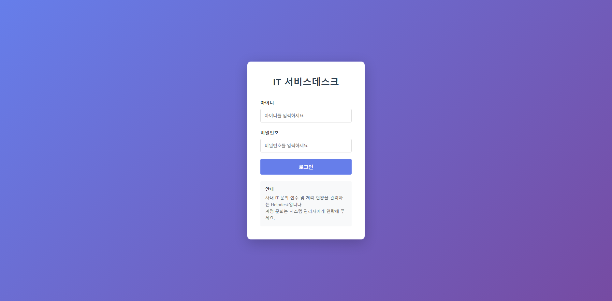
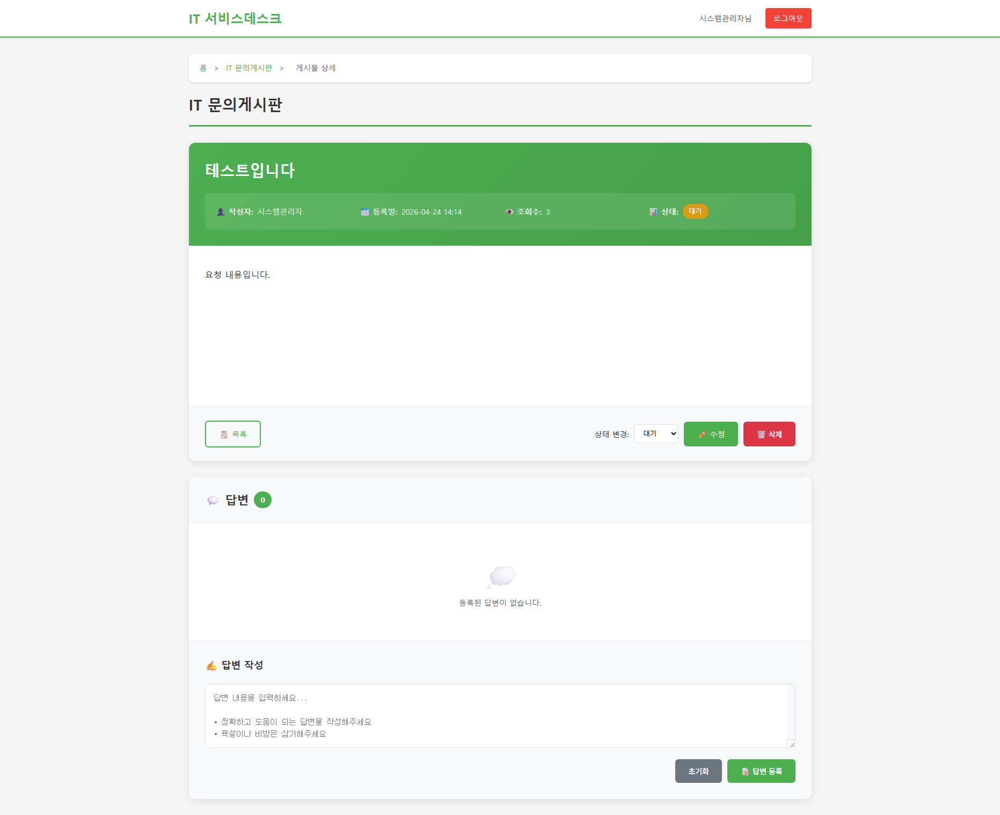
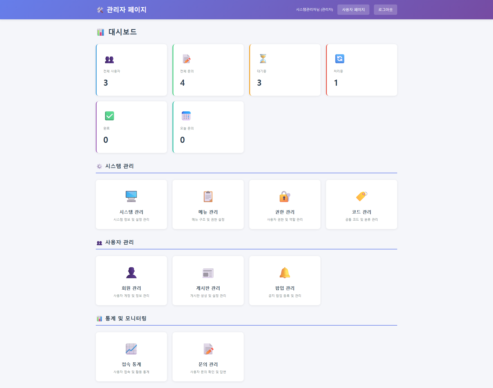

# Helpdesk Service Desk

IT 문의 접수와 운영 관리를 위한 사내 Helpdesk 웹 애플리케이션입니다. 일반 사용자는 문의를 등록하고 처리 현황을 확인할 수 있으며, 관리자는 게시판·회원·권한·메뉴·공통코드·팝업·통계를 통합 관리할 수 있습니다.

> 포트폴리오용 프로젝트 소개 문서

## 프로젝트 개요

| 항목 | 내용 |
| --- | --- |
| 프로젝트 | Helpdesk Service Desk |
| 유형 | 사내 IT 문의 관리 시스템 |
| Backend | Spring Boot 2.7, Java 8, MyBatis |
| Frontend | JSP, JSTL, JavaScript, jQuery, CSS |
| Database | Microsoft SQL Server |
| Build | Maven, WAR 패키징 |
| 인증 | 세션 기반 로그인 및 권한 제어 |

## 주요 기능

### 사용자 영역

- 로그인·로그아웃 및 비밀번호 변경
- 문의 게시판 조회·등록·수정·삭제
- 문의 상태 및 처리 이력 확인
- 관리자 답변 조회
- 첨부파일 업로드·다운로드
- FAQ 및 공지사항 조회
- 사용자 프로필 조회

### 관리자 영역

- 운영 대시보드 및 접속 통계
- 게시판·게시판 필드 관리
- 문의 접수·처리·완료 상태 관리
- 회원 승인·수정·비밀번호 초기화
- 역할별 메뉴 권한 관리
- 메뉴 정렬 및 접근 권한 설정
- 공통코드 그룹·상세코드 관리
- 팝업 및 시스템 설정 관리

## 핵심 구현 포인트

- **역할 기반 접근 제어**: 관리자와 일반 사용자의 메뉴·URL 접근을 분리했습니다.
- **업무 상태 관리**: 문의 상태를 Waiting, Received, Processing, Completed, Hold로 관리합니다.
- **관리자 기능 모듈화**: 게시판, 회원, 역할, 메뉴, 공통코드, 팝업, 통계를 기능별 Controller-Service-Mapper 구조로 분리했습니다.
- **MyBatis 매핑 분리**: 도메인별 Mapper 인터페이스와 XML SQL을 분리해 유지보수성을 높였습니다.
- **파일 처리**: 허용 확장자와 최대 용량을 설정으로 관리하고 문의 첨부파일 업로드·다운로드를 지원합니다.
- **공통 처리**: 로그인 인터셉터, 세션 유틸리티, 페이징 유틸리티를 공통 모듈로 구성했습니다.

## 화면 미리보기

실행 화면을 기준으로 사용자와 관리자 업무 흐름을 확인할 수 있도록 구성했습니다.

### 로그인



### 문의 상세



문의 상태, 작성자, 등록일, 조회수, 답변 작성 영역을 제공하며 관리자는 상태 변경과 답변 등록을 수행할 수 있습니다.

### 관리자 대시보드



전체 사용자·문의·처리 상태를 요약하고 시스템 관리, 메뉴·권한·코드 관리, 회원·게시판·팝업 관리, 통계 기능으로 연결합니다.

사용자 메인과 관리자 기능 메뉴 화면은 추가 캡처 후 같은 섹션에 확장할 수 있습니다.

## 프로젝트 구조

```text
src/main/java/com/helpdesk
├─ admin
│  ├─ board       게시판 관리
│  ├─ code        공통코드 관리
│  ├─ main        관리자 메인
│  ├─ member      회원 관리
│  ├─ menu        메뉴 관리
│  ├─ popup       팝업 관리
│  ├─ role        역할·권한 관리
│  ├─ stats       통계
│  └─ system      시스템 설정
├─ user
│  ├─ auth        로그인·인증
│  ├─ faq         FAQ
│  ├─ main        사용자 메인
│  ├─ post        문의 게시판
│  └─ profile     프로필
└─ common
   ├─ config      웹·파일 설정
   ├─ controller  공통 컨트롤러
   ├─ interceptor 로그인 인터셉터
   └─ util        세션·비밀번호·페이징 유틸리티
```

## 실행 방법

### 사전 요구사항

- JDK 8 이상
- Maven 3.6 이상
- Microsoft SQL Server 2019 이상

### 데이터베이스 초기화

`SETUP_DATABASE.sql`을 SQL Server에서 실행해 데이터베이스와 테이블을 생성합니다.

```bash
sqlcmd -S "localhost\\SQLEXPRESS" -U sa -P "<sa-password>" -i SETUP_DATABASE.sql
```

### 애플리케이션 설정

실행 전에 환경변수를 설정합니다. 비밀번호와 내부 경로는 소스에 직접 커밋하지 않습니다.

```powershell
$env:HELPDESK_DB_USERNAME = "appUser"
$env:HELPDESK_DB_PASSWORD = "<db-password>"
$env:HELPDESK_UPLOAD_PATH = "C:\helpdesk\upload"
```

### 빌드 및 실행

```bash
mvn clean package
java -jar target/helpdesk-1.0.0.war
```

브라우저에서 [http://localhost:8080](http://localhost:8080)에 접속합니다.

## 테스트 계정

초기화 SQL에 포함된 테스트 계정은 로컬 개발 환경에서만 사용합니다. 공개 저장소에는 운영 계정 및 실제 비밀번호를 포함하지 않습니다.

## 관련 문서

- [실행 가이드](RUN_GUIDE.md)
- [데이터베이스 스키마 정보](docs/DATABASE_SCHEMA_INFO.md)
- [게시판 등록 테스트 가이드](docs/BOARD_REGISTRATION_TEST_GUIDE.md)
- [사용자 게시글 목록 수정 기록](docs/USER_POST_LIST_FIX.md)
- [관리자 통계 연도 필터](docs/MAIN_STATS_YEAR_FILTER.md)

## 빌드 검증

2026-09-18 기준 `mvn -DskipTests package` 실행 결과 WAR 패키징에 성공했습니다.

## License

This project is for portfolio and educational purposes.
